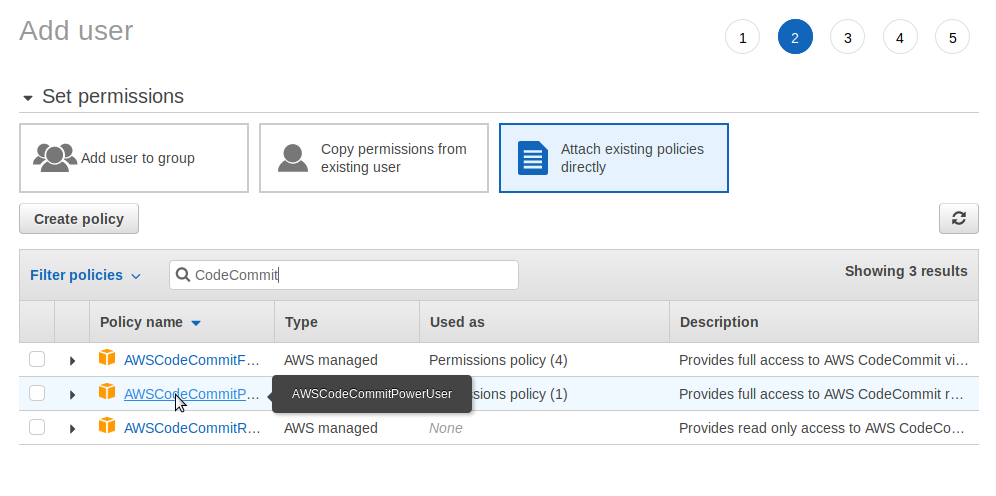
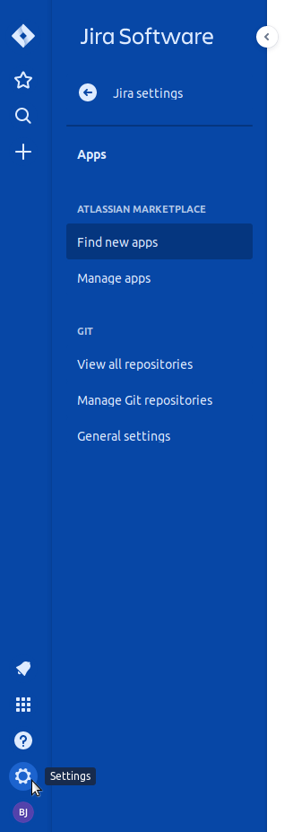
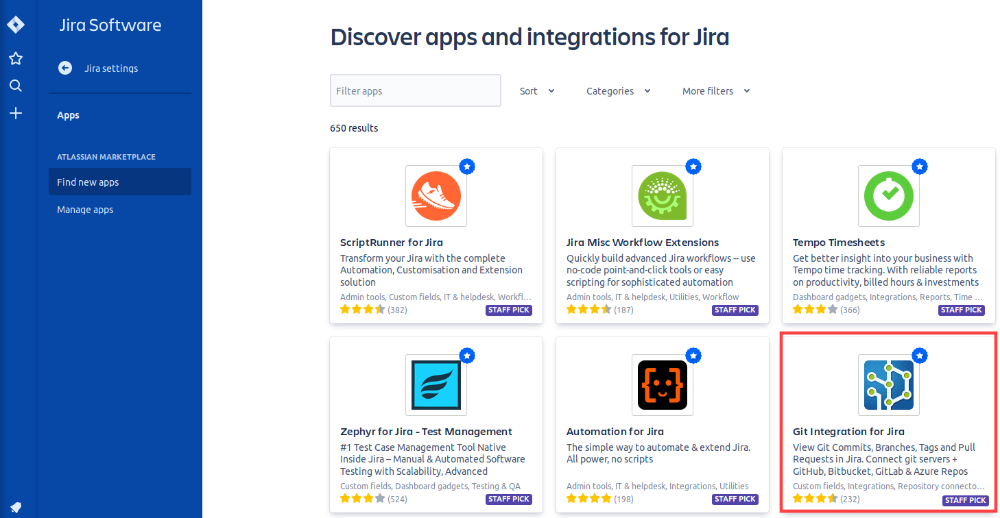
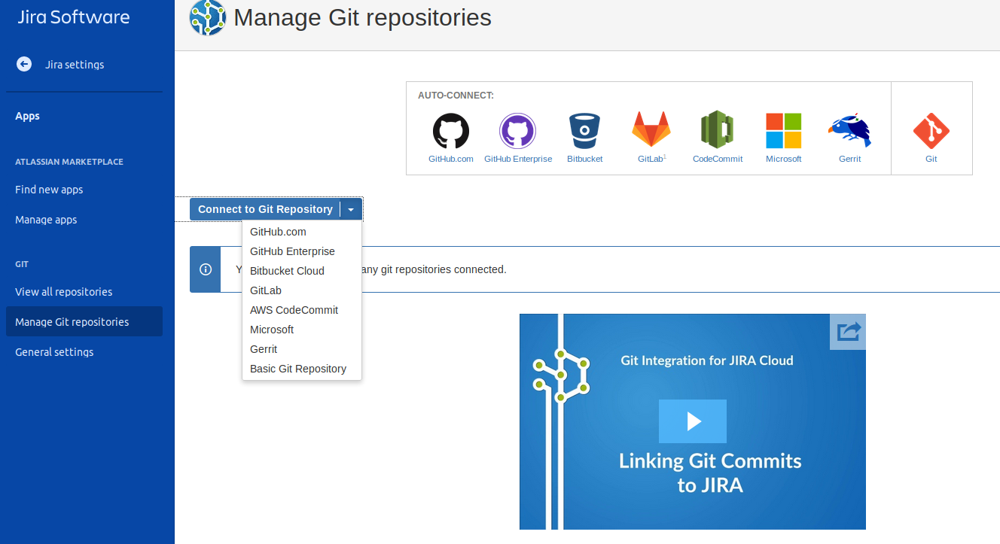
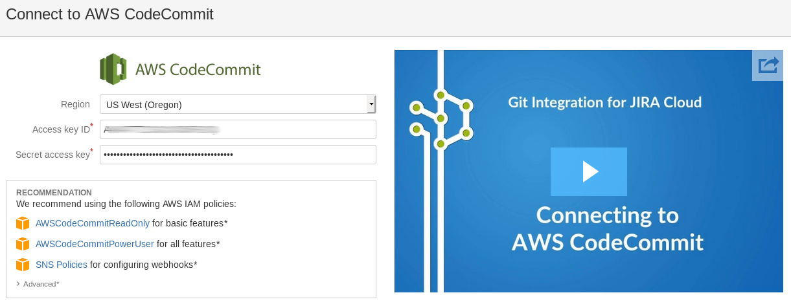
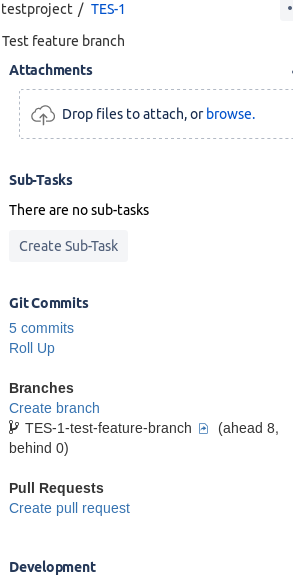

# Connecting JIRA to codecommit without the use of AWS CodeStar

So you are hosting your git repo in AWS CodeCommit and would like to add some issue tracking / project management to the repo.  Currently AWS doesn't offer any of its own services and thus we will need to hook in some 3rd party services such as [Atlassian's JIRA](https://www.atlassian.com/software/jira) and [GitHub](https://github.com/).   Connecting JIRA to CodeCommit is reasonably straightforward and if you would like to use AWS CodeStart templates there is good documentation available from both [Atlassian](https://www.atlassian.com/blog/jira-software/jira-software-integrates-with-aws-codestar) as well as in the CodeStar setup process itself.

One limitation of CodeStar at the moment is that it can only be used when setting up a fresh repository and cannot be used against an existing repo.  If this is the case or you simply do not want to use CodeStar for the issue tracking integration this post will walk through the process of setting up issue tracking without the use of CodeStar.

To complete this process you will need:

* An AWS account with FullAccess permissions to CodeCommit
* An AWS account with SNS (Simple Notification Service) permissions
* Ideally an AWS account with permissions to setup additional users.
* A JIRA cloud instance with admin rights.  If you want to just try it out you can set up a trial account for free at [https://www.atlassian.com/try](https://www.atlassian.com/try).

The process will assume:

* You have access to and have already setup the requirements listed above e.g. AWS accounts and JIRA cloud instances.
* A basic understanding AWS IAM roles.

## Let's get started.

We are first going to create a separate user with roles limited to CodeCommit in the spirit of principle of least privilege.

1. Log into the Identify and Access Management (IAM) page of AWS.
2. Click Add User
3. Create a user with an appropriate user name and ensure the **Programmatic access** checkbox is ticked.

4. Click Next: Permissions
5. If you have existing permissions you would like to use select those.  If you are unsure add the *AWSCodeCommitPowerUser* and *AmazonSNSFullAccess* permissions, they will be enough to get you started.  The AWSCodeCommitPowerUser permissions are used to allow for branches, merges etc to be created or reviewed from JIRA.  The SNS permissions are required to allow the git integration app to setup the webhooks for you for automatic updates whenever a repo is touched.  **You should review these permissions to ensure they are appropriate and satisfy security requirements**.

6. Add any tags you would like to attach to the user.
7. Create the user.

8. Download the CSV file or copy and paste the Access Key ID and Secret access key as you will need these later.

9. Open your JIRA cloud instance click on the settings icon in the bottom left hand side of the screen.

10. Click on the Apps section of the settings menu.
11. Click on **Find new apps** and search for or simply select **Git Integration for JIRA**.  Note that **Git Integration for JIRA** is a paid app and can be used for a 7 day trial without restrictions or payment.

12. Once the app is installed click on the connect to repository drop down menu and select AWS CodeCommit

13. Enter the AWS CodeCommit region for the repo you would like to connect to as well as the AWS Access Key and Secret access key that you created for the user above.

14. Click Next.
15. Confirm the list of repositorys discovered by JIRA is what you would expect for the connection.  Click Next.
16. In the next screen you can choose some project permissions.  If you would like all JIRA projects access to the CodeCommit repos just click Next.  If you would like to grant access to the repos to a list of specific JIRA projects untick the check box and type the name of the projects in the field shown below.

## Et Voila!!!

At this job JIRA is hooked into the CodeCommit and you should notice that the git integration app is indexing your repos.

If you have any commits in your git repo referencing existing issues you will notice that these commits and branches start to show up in your issues.

Try creating a commit with a issue reference and you will notice it shows up in the JIRA ticket!!
